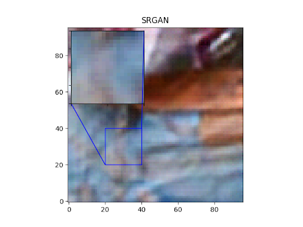
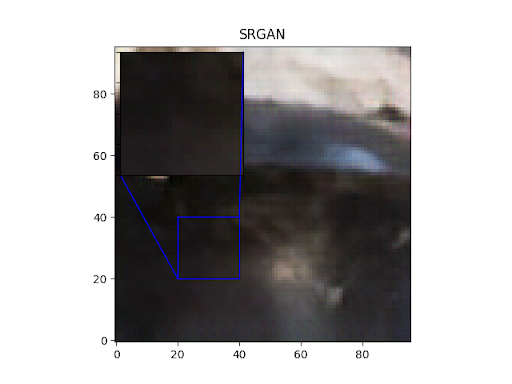

<h1 align="center">Welcome to SRGAN-tensorflow 👋</h1>
<p>
  
  <a href="https://github.com/karnikkanojia/SRGAN-tensorflow/README.md" target="_blank">
    
  </a>
  <a href="https://github.com/karnikkanojia/SRGAN-tensorflow/blob/main/LICENSE" target="_blank">
    
  </a>
  <a href="https://twitter.com/KanojiaKarnik" target="_blank">
    
  </a>
</p>

> Implementation for Super-Resolution Generative Adversarial Network in Tensorflow.

### 🏠 [Homepage](https://github.com/karnikkanojia/SRGAN-tensorflow)

### ✨ [Demo](https://github.com/karnikkanojia/SRGAN-tensorflow)

## Install

```sh
pip install -r requirements.txt
```

## Usage

```sh
python train_srgan.py
```

## Screenshots




## Author

👤 **Karnik Kanojia**

* Website: https://karnikkanojia.me
* Twitter: [@KanojiaKarnik](https://twitter.com/KanojiaKarnik)
* Github: [@karnikkanojia](https://github.com/karnikkanojia)
* LinkedIn: [@karnikkanojia](https://linkedin.com/in/karnikkanojia)

## Show your support

Give a ⭐️ if this project helped you!

## 📝 License

Copyright © 2022 [Karnik Kanojia](https://github.com/karnikkanojia).<br />
This project is [GNU GENERAL PUBLIC LICENSE](https://github.com/karnikkanojia/SRGAN-tensorflow/blob/main/LICENSE) licensed.

## Citations

```
@incollection{Chakraborty_2022_SRGAN,
  author = {Devjyoti Chakraborty},
  title = {Super-Resolution Generative Adversarial Networks {(SRGAN)}},
  booktitle = {PyImageSearch},
  editor = {Puneet Chugh and Aritra Roy Gosthipaty and Jon Haase and Susan Huot and Kseniia Kidriavsteva and Ritwik Raha and Abhishek Thanki},
  year = {2022},
  note = {https://pyimg.co/lgnrx},
}
```


***
_This README was generated with ❤️ by [readme-md-generator](https://github.com/kefranabg/readme-md-generator)_